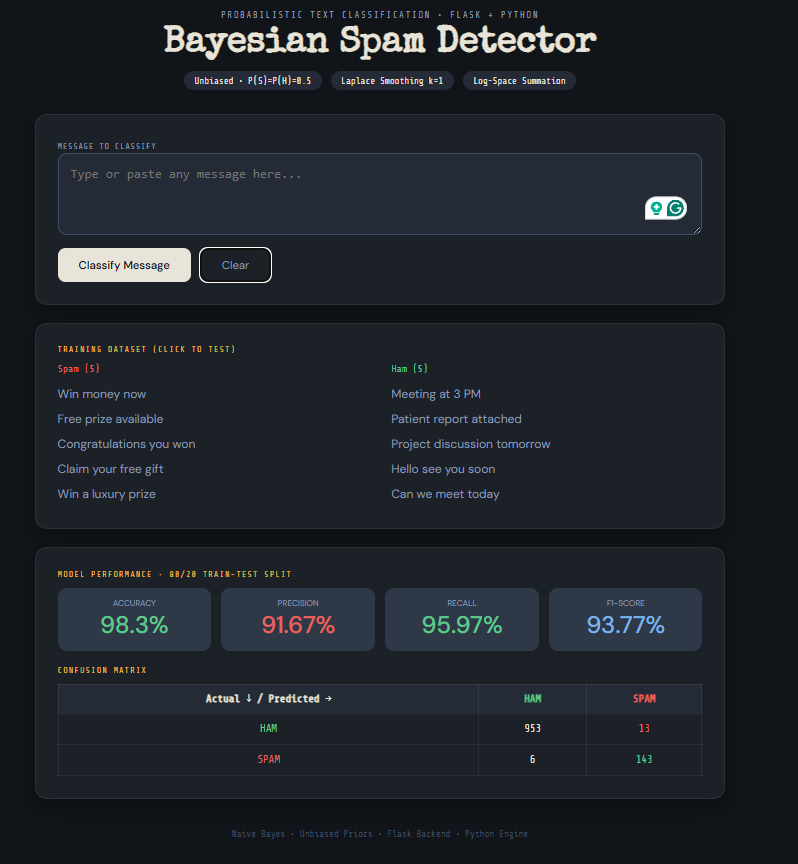
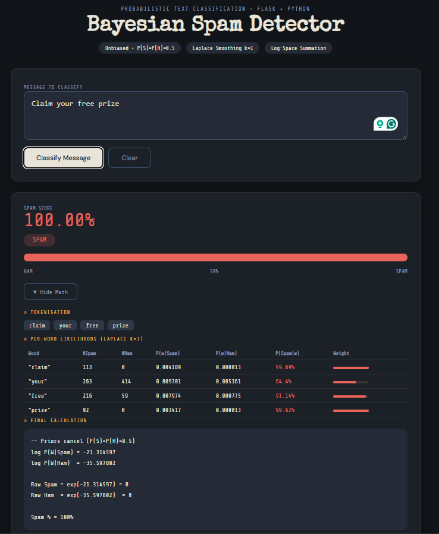
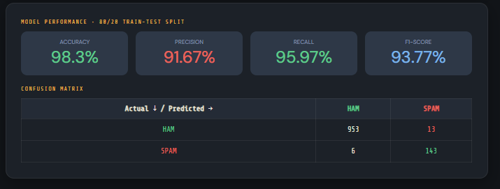
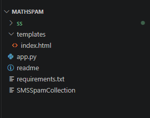

# Bayesian Spam Detector
### A Real-Time Flask Application built from Scratch

This repository features a professional-grade **SMS Spam Filter** developed as part of a Computer Science Engineering study on Bayesian Learning. Unlike standard implementations that rely on high-level libraries, this project features a **custom inference engine** built from first principles to demonstrate the mathematical rigor of the Naïve Bayes algorithm.

<br>

##  User Interface & Experience

<p align="center">
  
</p>

The application utilizes a professional, blackboard-themed **Flask interface**. This layout is designed for both high-stakes filtering and educational transparency, allowing users to select pre-set benchmarks or enter custom messages for real-time evaluation.

<br>

##  Explainable AI: The "Show Math" Panel

<p align="center">
  
</p>

To ensure the model's logic is verifiable against manual calculations, I engineered a **Transparency Panel**. This feature bridges the gap between raw code and mathematical theory by providing a live trace of the logic:

* **Tokenization:** Displays the cleaning process where raw text is lower-cased and stripped of noise characters.
* **Per-Word Likelihoods:** Shows the specific probabilities ($P(W|Spam)$ and $P(W|Ham)$) calculated with **Laplace Smoothing ($k=1$)**.
* **Log-Space Summation:** Demonstrates the calculation used to determine the posterior probability safely without numerical errors.

<br>

##  Performance & Evaluation

<p align="center">
  
</p>

The system was trained on the **UCI SMS Spam Collection** (5,572 messages) using an **80/20 stratified train-test split**. The engine achieved high reliability across all key metrics:

* **Accuracy:** 98.3%
* **Recall:** 95.97% (Ensuring maximum detection of intrusive spam)
* **Precision:** 91.67%
* **F1-Score:** 93.77%

<br>

##  System Architecture

<p align="center">
  
</p>

The project is structured for modularity to ensure a clean separation between the backend logic and the frontend:

* **`app.py`**: The core Python script housing the custom Bayesian engine and Flask routes.
* **`templates/`**: HTML/CSS files for the Blackboard UI.
* **`SMSSpamCollection`**: The raw dataset used for training and testing.
* **`requirements.txt`**: Lists necessary dependencies (Flask, Pandas).

<br>

##  Quick Start

1. **Clone the Repository:**
   ```bash
   git clone [https://github.com/MeghaZachariah/Bayesian-Spam-Detector-Flask.git](https://github.com/MeghaZachariah/Bayesian-Spam-Detector-Flask.git)

2. Install Dependencies:

    Bash
    pip install -r requirements.txt

3. Run the Application:

    Bash
    python app.py
